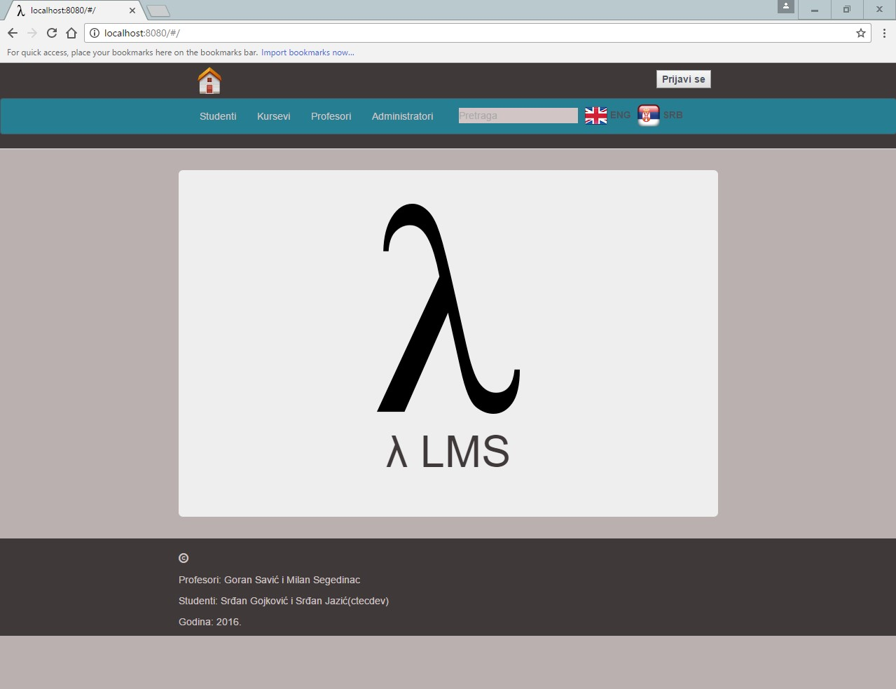
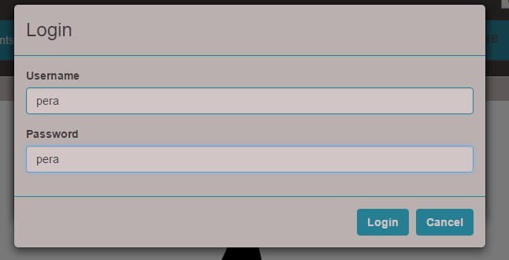
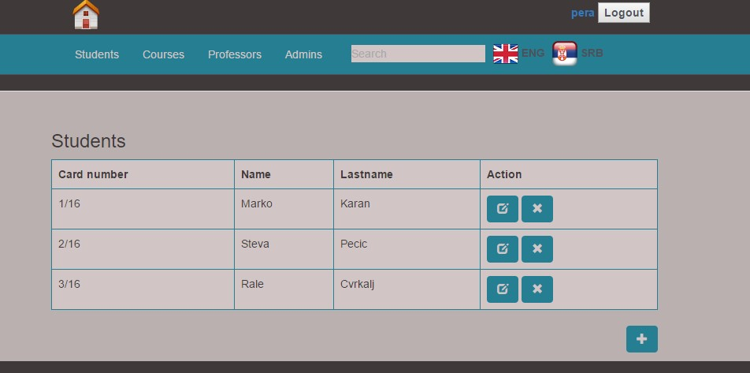
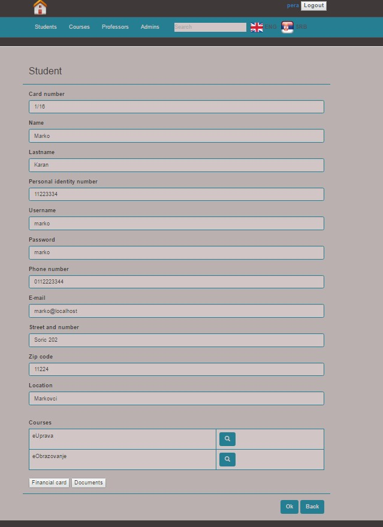
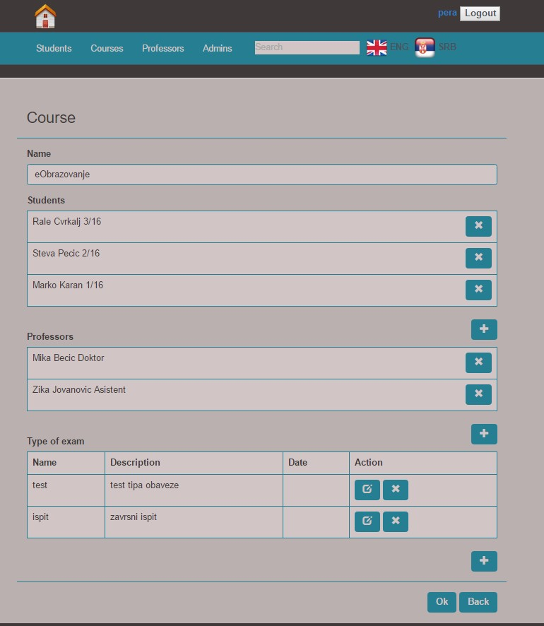

# work-services

Application that implements BPMN model.
It search offers for execution of certain services.

## Getting Started

These instructions will get you a copy of the project up and running on your local machine for development and testing purposes. See deployment for notes on how to deploy the project on a live system.

### Prerequisites

What things you need to install the software and how to install them

[Java 1.8](http://www.oracle.com/technetwork/java/javase/downloads/jdk8-downloads-2133151.html)

[Maven](https://maven.apache.org/)

[Ruby](https://www.ruby-lang.org/en/)

[Ruby's gem compass](http://compass-style.org/install/)
```
	gem install compass
```
[Node.js](https://nodejs.org/en/)
```
	npm install grunt-cli -g
	npm install bower -g
```
### Setup

A step by step series of examples that tell you have to get a development env running

Import project to Eclipse workspace
```
File > Import >>> General > Existing Projects into Workspase
```

Configure as Maven Project

```
*Step One:* Right click on Project > Configure > Convert to Maven Project
*Step Two:* Right click on Project > Maven > Update Project...
```

Set configurations for the database connection
```
/src/main/resources/application.properties
`ddl-auto=update`this means that Hibernate will create tables in database after first app run.
Run app one time to do that... 
```

To Run Application:
```
Open package `rs.ac.uns.ftn.tseo.ctecdev` in '/src/main/java/' folder 
right there there is a class `Admin_Edu_Ins_App.java`
Right click on that class > Run As > Java Application
Application will run on `http://localhost:8080/`
```
*Note - To run app on some other port, add in application.properties "server.port=<>port-number<>"

## Running and testing

There is no automated tests, to test app manualu follow instructions :)

### Initialize database

In folder `database` there is a script for database `insert.sql`
```
run script over database in MySQL Workbench-a
```

### Go to localhost
```
Go to `http://localhost:8080/` or if you changed port `http://localhost:<port-number>/`
```


### Testing

To test app login as admin


Username: pera 
Password: pera



## Built With 

* [ Java 1.8 ](http://www.oracle.com/technetwork/java/javase/downloads/jdk8-downloads-2133151.html)
* [ JavaScript ](https://www.javascript.com/)
* [ AngularJS ](https://docs.angularjs.org/guide) - FrontEnd 
* [ SpringBoot framework ](https://projects.spring.io/spring-boot/) - BackEnd
* [ Maven ](https://maven.apache.org/) - Dependency Management

## Authors

* **Srđan Jazic** - [ https://github.com/ctecdev ](https://github.com/ctecdev)
* **Srđan Gojković**

## Acknowledgments

* This project is developed as part of exam on Faculty of Technical Sciences in Novi Sad
  
## Additiona photos






